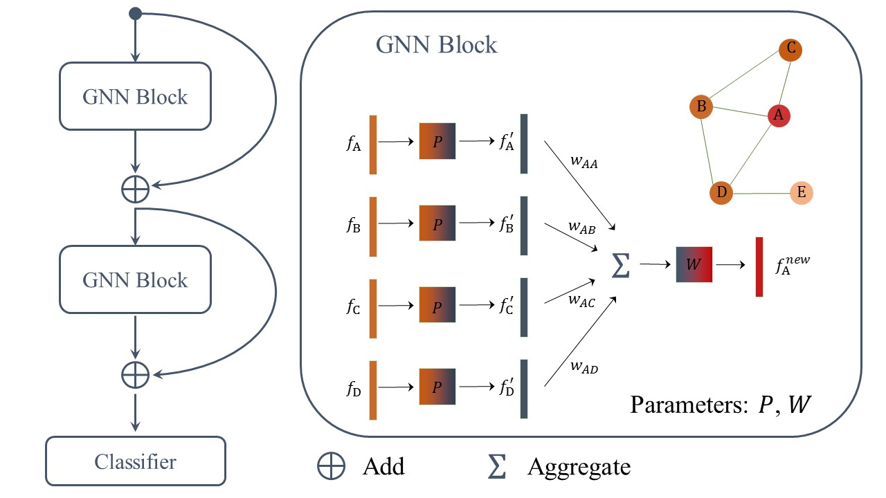

# Multi-Layer-Graph-Neural-Network-for-Image-Retrieval

## viewpoint

Aggregate information of neighbor nodes to produce a new feature representation for each node. Tested in image retrieval task.

## reference

[Inductive Representation Learning on Large Graphs](https://papers.nips.cc/paper/6703-inductive-representation-learning-on-large-graphs.pdf), 2017, NeurIPS

## framework



## platform

- Pytorch 1.2.0

- Python 3.7.5

- Visdom 0.1.8.9

- Tensorboard 2.0.0

- Tensorflow 2.0.0

## datasets

### testing

- [Oxford5k](https://www.robots.ox.ac.uk/~vgg/data/oxbuildings/)
  
- [Parid6k](https://www.robots.ox.ac.uk/~vgg/data/parisbuildings/)

- [ROxford5k](http://cmp.felk.cvut.cz/revisitop/)

- [RParid6k](http://cmp.felk.cvut.cz/revisitop/)

- +[flickr100k](http://www.robots.ox.ac.uk/~vgg/data/oxbuildings/flickr100k.html)

### training

- [landmark_clean](https://europe.naverlabs.com/Research/Computer-Vision/Learning-Visual-Representations/Deep-Image-Retrieval/)


## parameter instruction

- `knn`: number of neighbors to aggregate.

- `suffix`: feature type, vgg-rmac-feature (512-d) and res101-gem-feature (2048-d) are used.

- `train_num`: number of training nodes. Training loss: cross entropy/rank loss.

- `aggre_type`: mean aggregation of max aggregation.

- `embed_dims`: dims of input-hidden-...-output layers.

- `combine`: concate features from all layers.

- `activate`: use non-lineaer activation function on feature.

- `residue`: residue connection from former layer.

- `weighted`: weighted aggregation based on feature similairty.

A typical setting:

```
python main.py --combine False --residue True --weighted True --learning_rate 0.001 --knn 10 --batch_size 64 --aggre_layer_num 1 --embed_dims 2048 2048 --aggre_type max --mode class 
```